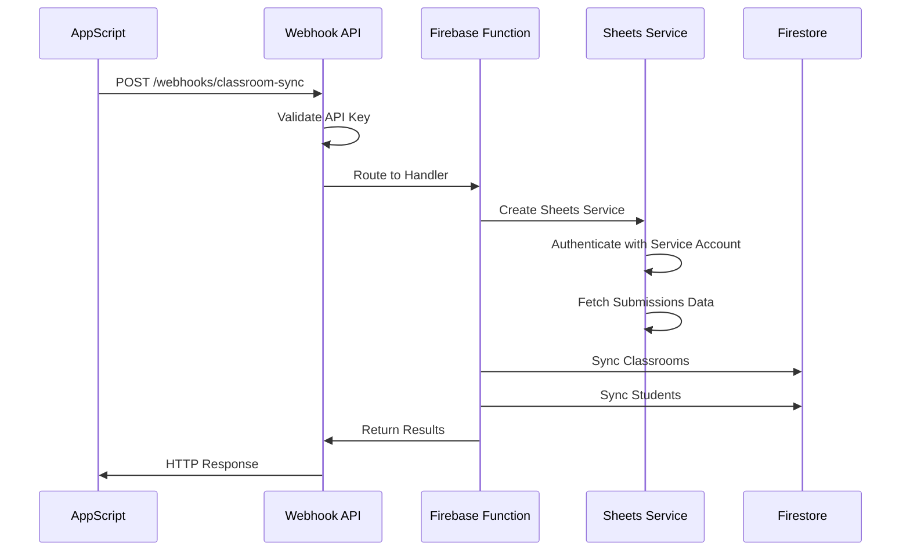

# 🔗 Webhook Integration Architecture

**Status**: ✅ Working as of August 2025  
**Last Updated**: 2025-08-01

This document provides a technical deep-dive into the webhook integration system that connects AppScript processing to Firebase Functions.

## 🏗️ **Architecture Overview**

```
Google AppScript → Webhook API → Firebase Functions → Firestore Database
       ↓               ↓              ↓                    ↓
   [Teacher's]     [Authentication]  [Data Processing]  [Storage]
   [School Drive]   [& Validation]   [& Sync Logic]     [& Persistence]
```

---

## 🔐 **Authentication Layer**

### **API Key Authentication**
**Location**: `functions/src/routes/webhooks.ts:validateApiKey()`

```typescript
// Request Headers Required:
{
  'X-API-Key': 'roo-webhook-dev-stable123456',
  'Content-Type': 'application/json'
}

// Valid API Keys (Development):
const defaultKeys = [
  "roo-webhook-dev-stable123456",     // Individual teacher testing
  "roo-board-integration-stable456"  // Board web app integration
];
```

### **Security Model**
- **No JWT/OAuth**: Simple API key authentication for webhook calls
- **Environment Variables**: Production should use `WEBHOOK_API_KEYS` env var
- **Fallback Keys**: Hardcoded development keys for testing
- **Request Validation**: Logs invalid attempts with IP and user agent

---

## 📡 **Webhook Endpoint**

### **Endpoint Details**
```
POST https://us-central1-roo-app-3d24e.cloudfunctions.net/api/webhooks/classroom-sync
```

### **Request Payload**
```typescript
interface WebhookPayload {
  spreadsheetId: string;    // Google Sheets ID
  teacherId: string;        // Teacher's email address
  timestamp: string;        // ISO timestamp
  source: string;           // "board-webapp" or "appscript-webhook"
}
```

### **Response Format**
```typescript
// Success Response (200/207)
{
  success: boolean;
  data: {
    classroomsCreated: number;
    classroomsUpdated: number;
    studentsCreated: number;
    studentsUpdated: number;
    errors?: string[];
  };
  message?: string;
  timestamp: string;
}

// Error Response (401/403/500)
{
  success: false;
  error: string;
  details?: string;
  guidance?: string;          // For permission errors
  troubleshooting?: string[]; // Step-by-step help
  timestamp: string;
}
```

---

## 🔄 **AppScript Integration**

### **Webhook Call Function**
**Location**: AppScript `syncToRooSystem()`

```javascript
function syncToRooSystem(sheetId, apiKey) {
  const payload = {
    spreadsheetId: sheetId,
    teacherId: determineTeacherId(sheetId),
    timestamp: new Date().toISOString(),
    source: 'board-webapp'
  };

  const response = UrlFetchApp.fetch(BOARD_CONFIG.WEBHOOK_URL, {
    method: 'POST',
    headers: {
      'X-API-Key': apiKey,
      'Content-Type': 'application/json'
    },
    payload: JSON.stringify(payload),
    muteHttpExceptions: true
  });

  // Process response and return results
}
```

### **Integration Points**
- **Called by**: `processAllSubmissions()` function
- **Timing**: After data processing and sheet writing
- **Error Handling**: Graceful failure with logging
- **Retry Logic**: Not implemented (could be added)

---

## 🚀 **Firebase Function Processing**

### **Main Handler**
**Location**: `functions/src/routes/webhooks.ts:handleClassroomSyncWebhook()`

```typescript
export async function handleClassroomSyncWebhook(req: Request, res: Response) {
  // 1. Authentication validation
  const apiKey = req.headers['x-api-key'] as string;
  if (!validateApiKey(apiKey)) {
    return res.status(401).json({ success: false, error: "Invalid API key" });
  }

  // 2. Parameter validation
  const { spreadsheetId, teacherId } = req.body;
  if (!spreadsheetId) {
    return res.status(400).json({ success: false, error: "spreadsheetId is required" });
  }

  // 3. Service creation and processing
  const syncService = createClassroomSyncService();
  const result = await syncService.syncClassroomsFromSheets(teacherId, spreadsheetId);

  // 4. Response handling
  return res.status(result.success ? 200 : 207).json(result);
}
```

### **Error Handling Enhancement**
**Location**: Enhanced error handling for permission issues

```typescript
// Permission-specific error handling
if (errorMessage.includes('403') || errorMessage.includes('permission')) {
  return res.status(403).json({
    success: false,
    error: "Permission denied accessing Google Sheet",
    guidance: `Please ensure your Google Sheet is shared with: ${SERVICE_ACCOUNT_EMAIL}`,
    troubleshooting: [
      "1. Open your Google Sheet",
      "2. Click the 'Share' button",
      `3. Add this email: ${SERVICE_ACCOUNT_EMAIL}`,
      "4. Give 'Editor' permissions",
      "5. Try the webhook again"
    ]
  });
}
```

---

## 📊 **Data Processing Pipeline**

### **Classroom Sync Service**
**Location**: `functions/src/services/classroom-sync.ts`

```typescript
class ClassroomSyncService {
  async syncClassroomsFromSheets(teacherId: string, spreadsheetId: string) {
    // 1. Create authenticated Google Sheets service
    const sheetsService = await createSheetsService(spreadsheetId);
    
    // 2. Fetch all submissions from Google Sheets
    const submissions = await sheetsService.getAllSubmissions();
    
    // 3. Group submissions by classroom/course
    const submissionsByClassroom = this.groupSubmissionsByClassroom(submissions);
    
    // 4. Sync classrooms to Firestore
    const classroomResults = await this.syncClassrooms(teacherId, submissionsByClassroom);
    
    // 5. Sync students to Firestore
    const studentResults = await this.syncStudents(teacherId, submissions);
    
    // 6. Return comprehensive results
    return this.buildSyncResults(classroomResults, studentResults);
  }
}
```

### **Google Sheets Service**
**Location**: `functions/src/services/sheets.ts`

```typescript
export const createSheetsService = async (spreadsheetId: string) => {
  // Use Firebase default service account credentials
  const authClient = new google.auth.GoogleAuth({
    scopes: ["https://www.googleapis.com/auth/spreadsheets"]
  });

  const authInstance = await authClient.getClient();
  return new SheetsService(authInstance, spreadsheetId);
};
```

---

## 🔧 **Service Account Integration**

### **Automatic Permission Grant**
**Location**: `functions/src/services/base-sheet-service.ts:shareWithBoardAccount()`

```typescript
protected async shareWithBoardAccount(spreadsheetId: string, boardAccountEmail: string) {
  // Share with board account (teacher's institutional email)
  await this.drive.permissions.create({
    fileId: spreadsheetId,
    resource: {
      role: "writer",
      type: "user",
      emailAddress: boardAccountEmail
    },
    sendNotificationEmail: true
  });

  // Share with service account (for webhook access) - CRITICAL FIX
  await this.drive.permissions.create({
    fileId: spreadsheetId,
    resource: {
      role: "writer",
      type: "user",
      emailAddress: SERVICE_ACCOUNT_EMAIL
    },
    sendNotificationEmail: false
  });
}
```

### **Service Account Details**
- **Email**: `firebase-adminsdk-fbsvc@roo-app-3d24e.iam.gserviceaccount.com`
- **Permissions**: Full "writer" access to shared sheets
- **Scope**: Google Sheets API read/write operations
- **Authentication**: Automatic via Firebase default service account

---

## 📈 **Monitoring & Logging**

### **AppScript Logging**
```javascript
// Comprehensive logging in AppScript
console.log("🔗 Calling Roo webhook...");
console.log("📤 Webhook payload:", JSON.stringify(payload, null, 2));
console.log("📥 Webhook response code:", responseCode);
console.log("📥 Webhook response:", responseText);
```

### **Firebase Function Logging**
```typescript
// Structured logging in Firebase Functions
logger.info("Webhook classroom sync initiated", {
  teacherId,
  spreadsheetId,
  source: "appscript-webhook",
  timestamp: new Date().toISOString()
});

logger.info("Webhook classroom sync completed", {
  teacherId,
  success: result.success,
  classroomsCreated: result.classroomsCreated,
  errorCount: result.errors.length
});
```

### **Error Tracking**
- **AppScript**: View → Executions shows all webhook calls
- **Firebase**: Functions logs show processing details
- **Firestore**: Error documents can be stored for debugging

---

## ⚡ **Performance Considerations**

### **Timeout Handling**
- **AppScript**: 6-minute execution limit
- **Firebase Functions**: 9-minute timeout (2nd gen)
- **Webhook**: 30-second default timeout in AppScript

### **Rate Limiting**
- **Google Sheets API**: 100 requests per 100 seconds per user
- **Firebase Functions**: 3,000 requests per minute
- **AppScript**: 6-minute script runtime limit

### **Optimization Strategies**
- **Batch Operations**: Use spreadsheet batch updates
- **Caching**: Cache authentication tokens
- **Error Recovery**: Implement retry logic for transient failures

---

## 🔄 **Data Flow Sequence**



---

## 🚨 **Common Integration Issues**

### **Authentication Failures**
- **Symptom**: 401 Unauthorized responses
- **Cause**: Missing or invalid API key
- **Solution**: Verify API key matches server validation

### **Permission Errors**
- **Symptom**: 403 Forbidden from Google Sheets
- **Cause**: Service account not shared with sheet
- **Solution**: Automatic sharing during onboarding (now fixed)

### **Timeout Issues**
- **Symptom**: AppScript reports timeout
- **Cause**: Large datasets or slow Firebase processing
- **Solution**: Implement pagination or async processing

### **Data Sync Failures**
- **Symptom**: Partial success with errors
- **Cause**: Invalid data formats or Firestore constraints
- **Solution**: Enhanced data validation and error reporting

---

## 🎯 **Integration Success Metrics**

### **Response Time Targets**
- **Webhook Response**: < 30 seconds
- **Data Processing**: < 2 minutes
- **Full Sync**: < 5 minutes for typical classroom

### **Reliability Targets**
- **API Availability**: 99.9% uptime
- **Authentication Success**: 100% with valid keys
- **Data Sync Success**: 95% success rate

### **Error Rate Thresholds**
- **4xx Errors**: < 1% (client errors)
- **5xx Errors**: < 0.1% (server errors)
- **Timeout Errors**: < 2% (processing time)

---

**This architecture provides a robust, secure, and scalable integration between Google Apps Script and Firebase Functions, enabling seamless data synchronization for the Roo educational platform.**